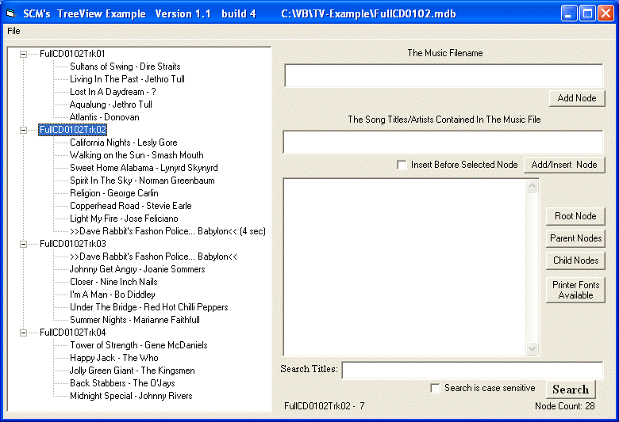



## TreeView Example\-2

### Description

Treeview example showing how to populate, save,load and print a treeview control. This is our 2nd example which now allows the user to insert an entry before or after a child. The size of the form also has been reduced to allow a lower screen resolution. Rp
 
### More Info
 

             |
---                |---
**Submitted On**   |2009-09-15 01:00:02
**By**             |[R\.  Pierce](https://github.com/Planet-Source-Code/PSCIndex/blob/master/ByAuthor/r-pierce.md)
**Level**          |Beginner
**User Rating**    |5.0 (15 globes from 3 users)
**Compatibility**  |VB 5\.0, VB 6\.0
**Category**       |[Miscellaneous](https://github.com/Planet-Source-Code/PSCIndex/blob/master/ByCategory/miscellaneous__1-1.md)
**World**          |[Visual Basic](https://github.com/Planet-Source-Code/PSCIndex/blob/master/ByWorld/visual-basic.md)
**Archive File**   |[TreeView\_E2162539152009\.ZIP](https://github.com/Planet-Source-Code/r-pierce-treeview-example-2__1-72424/archive/master.zip)

